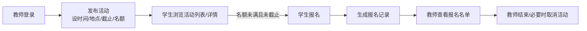

# 01 需求分析

> 校园活动管理系统 V1.0 · 需求分析
> 依据《实验一 基于工程意图的软件迭代开发》任务背景：学校希望建设校园活动管理系统，为校园活动的组织和学生参与提供信息化支持。

## 1. 业务背景理解

校园活动的组织目前依赖线下通知、口头传达或班级群转发，存在三类问题：

1. **学生了解活动难**：活动信息分散，学生不知道有哪些活动、什么时间地点、如何参与；
2. **报名过程乱**：报名靠接龙/填表，容易出现漏报、重复报、人数超出场地容量，且报名结果没有记录；
3. **教师组织缺工具**：教师发布活动没有统一入口，报名名单靠手工统计，活动结束后没有沉淀。

V1.0 的目标是先把"**教师发活动 → 学生看到 → 学生报名 → 教师获得名单**"这条最基本的业务闭环做成信息化，而不是堆砌功能。

## 2. 用户与目标

| 用户 | 身份特征 | 核心目标 |
|---|---|---|
| 学生 | 注册学生账号 | 了解校园里有哪些活动，在截止前报名参加，管理自己的报名 |
| 活动组织教师 | 注册教师账号 | 发布活动并设定参与规则，查看和管理报名情况，维护活动状态 |
| （明确不纳入 V1.0）系统管理员 | — | 见 §5，账号与活动按角色自治，暂不需要统一后台 |

对两种用户而言，本系统都不是"发通知的平台"，而是围绕**报名关系**的记录系统：一条报名记录同时服务于学生的"我参加了什么"与教师的"谁报名了我的活动"。

## 3. 核心业务过程（V1.0 必须跑通的主线）

## 4. 功能需求清单

| 编号 | 需求 | 角色 | 要点 / 验收标准 |
|---|---|---|---|
| FR-1 | 账号注册与登录 | 学生/教师 | 注册时选择身份（学生/教师）；密码哈希存储；登录后识别身份 | 
| FR-2 | 浏览活动列表 | 公开（含未登录） | 列出全部活动，展示动态状态（报名中/报名已截止/进行中/已结束/已取消）、时间地点、名额与已报名数；按活动开始时间排序。"了解活动"不需要登录 |
| FR-3 | 查看活动详情 | 公开 | 完整活动信息（主题/描述/地点/时间/报名截止/名额/已报名人数） |
| FR-4 | 发布活动 | 教师 | 必填：主题、描述、地点、活动开始时间、报名截止时间；可选：人数上限（空=不限）。**业务规则**：报名截止须早于活动开始时间；不允许发布已开始的活动 |
| FR-5 | 学生报名活动 | 学生 | **业务规则（服务端强制）**：① 仅学生身份可报；② 活动状态有效（未取消/未结束）；③ 当前时间未过报名截止；④ 未满员（人数上限>0 时）；⑤ 每人每活动至多一条报名记录（数据库 UNIQUE 约束兜底） |
| FR-6 | 学生取消报名 | 学生 | 报名截止前可取消自己的报名；截止后名单锁定不可取消（保证教师拿到的名单稳定） |
| FR-7 | 查看我的报名 | 学生 | 已报名的活动与状态（后续版本可做"我的活动"页，V1.0 通过列表页"已报名"标识满足） |
| FR-8 | 查看报名名单 | 教师 | 仅**该活动发布教师本人**可看：报名学生昵称/账号/报名时间 |
| FR-9 | 结束活动 | 教师 | 本人发布的活动可标记"已结束"，之后不可再报名 |
| FR-10 | 取消活动 | 教师 | 本人发布的活动可取消（如场地原因），取消后不可报名，已报名学生名单保留备查 |
| FR-11 | 我发布的活动 | 教师 | 一览自己发布的活动及当前报名人数，入口直达名单与状态管理 |

### 权限矩阵

| 能力 | 未登录 | 学生 | 教师（本人活动） | 教师（他人活动） |
|---|---|---|---|---|
| 浏览列表/详情 | ✅ | ✅ | ✅ | ✅ |
| 发布活动 | ❌ | ❌ | ✅ | — |
| 报名/取消报名 | ❌（引导登录） | ✅（按 FR-5/6 规则） | ❌ | — |
| 名单/结束/取消 | ❌ | ❌ | ✅ | ❌（403） |

## 5. 候选但未纳入 V1.0（含理由）

需求取舍遵循实验要求："**不以功能数量作为评价依据，优先保证确定的需求形成合理的基本业务过程**"。

| 候选需求 | 未纳入理由 |
|---|---|
| 活动编辑/删除 | 发布后状态由"结束/取消"管理即可覆盖 V1.0 的变更场景；编辑引入"已报名用户看到的信息不一致"问题，需版本化处理，超出 V1.0 |
| 搜索/筛选/分页 | 校园活动量级小，列表一次呈现即可；排序已按开始时间 |
| 报名时间冲突检测（同一学生同一时段两活动） | 需引入时间段交叉算法与提示策略，对 V1.0 的演示与验证价值低 |
| 活动签到/二维码 | 属于活动现场环节，依赖线下流程设计 |
| 活动分类/标签 | 目前活动数量少，分类价值低 |
| 管理员后台 | 账号角色自治即可支撑 V1.0 业务；后台涉及审核流（活动审核、账号封禁），属后续治理需求 |
| 报名导出 Excel | 名单页面可复制，V1.0 不做文件导出 |
| 消息通知/邮件提醒 | 需要通知渠道对接，V1.0 无此基础设施 |

以上候选在后续版本（V2.0+）的需求讨论中按业务优先级重新评估。

## 6. 需求间潜在冲突与消解

- **"学生能了解活动" vs "仅登录可见"**：采纳公开浏览，报名才需登录 → 降低学生了解门槛，与 FR-2 一致。
- **"名单稳定" vs "学生自主取消"**：取消窗口限定在报名截止前，截止后教师侧名单即为最终名单 → FR-6 中明确。
- **"教师结束活动" vs "报名截止时间后自动关闭"**：报名通道由**截止时间自动关闭**（避免依赖教师手动操作）；"结束"是教师对整场活动的收尾动作 → 见 03-软件设计"生命周期状态与派生状态"。
