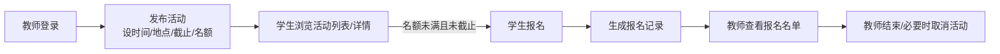

# 01 需求分析

> 校园活动管理系统 V1.0 · 需求分析
> 依据《实验一 基于工程意图的软件迭代开发》任务背景：学校希望建设校园活动管理系统，为校园活动的组织和学生参与提供信息化支持。

## 1. 业务背景理解

校园活动的组织目前依赖线下通知、口头传达或班级群转发，存在三类问题：

1. **学生了解活动难**：活动信息分散，学生不知道有哪些活动、什么时间地点、如何参与；
2. **报名过程乱**：报名靠接龙/填表，容易出现漏报、重复报、人数超出场地容量，且报名结果没有记录；
3. **教师组织缺工具**：教师发布活动没有统一入口，报名名单靠手工统计，活动结束后没有沉淀。

V1.0 的目标是先把"**教师发活动 → 学生看到 → 学生报名 → 教师获得名单**"这条最基本的业务闭环做成信息化，而不是堆砌功能。

## 2. 用户与目标

| 用户 | 身份特征 | 核心目标 |
|---|---|---|
| 学生 | 注册学生账号 | 了解校园里有哪些活动，在截止前报名参加，管理自己的报名 |
| 活动组织教师 | 注册教师账号 | 发布活动并设定参与规则，查看和管理报名情况，维护活动状态 |
| （明确不纳入 V1.0）系统管理员 | — | 见 §5，账号与活动按角色自治，暂不需要统一后台 |

对两种用户而言，本系统都不是"发通知的平台"，而是围绕**报名关系**的记录系统：一条报名记录同时服务于学生的"我参加了什么"与教师的"谁报名了我的活动"。

### 2.1 产品目标（对象—能力—结果）

产品目标不是功能清单，而是对用户价值的稳定表达。用"对象—能力—结果"三要素检查：

| 要素 | 内容 |
|---|---|
| **对象** | 校园里的活动组织教师与在校学生；未登录访客可浏览公开活动信息 |
| **能力** | 统一发布活动信息；记录并约束报名关系（身份 / 截止 / 名额 / 去重）；向发布教师交付确定的报名名单 |
| **结果** | 教师不必再手工统计接龙；学生不必反复确认"我报上没有"；报名关系第一次有确定、排重、可追溯的记录 |

三者缺一不可：只说"开发一个活动管理系统"过于宽泛，无法指导优先级与验收；只说"做一个报名按钮"则把解决方案当成了问题本身。

### 2.2 系统边界

边界解决"系统管到哪里"，范围解决"这一轮做到什么程度"。

| | 内容 |
|---|---|
| **系统内**（本系统负责） | 保存活动信息与报名关系；按规则校验报名与取消；展示活动状态与已报名人数；向发布教师交付报名名单；取消/结束活动后保留名单备查；保存用户账号（**本系统自建账号**：注册时自填用户名与身份，密码单向哈希存储，登录即建立会话） |
| **系统外**（本系统不负责，也不假装负责） | 活动的实际举办；场地、物资与人员安排；线下通知与宣传；活动内容的真实性与质量；**用户身份的真实性核验**（注册即生效，本版本不做实名或学籍校验，也不对接学校统一身份认证） |
| **当前版本范围** | 账号注册登录 → 浏览活动 → 教师发布 → 学生报名与取消 → 教师查看名单并收口（FR-1 ~ FR-11） |
| **暂不包含** | 活动编辑删除、搜索筛选分页、报名时间冲突检测、活动签到、消息通知、管理员后台（逐项理由见 §5.2） |

"暂不包含"不是永久拒绝，而是当前版本的边界；边界不清时，软件容易承担无法兑现的现实责任（例如把"活动办得怎么样"算到系统头上）。

## 3. 核心业务过程（V1.0 必须跑通的主线）

## 4. 需求清单与用户故事

需求以**用户故事**表达：把需求放回具体使用者和业务目标中，而不是只写功能名称。每条故事配**验收标准**（正常流程 / 异常流程 / 权限边界），让"完成"可以被判断——避免把"页面做出来了"误认为需求完成。

故事编号 `US-xx` 与下方需求编号 `FR-x` 一一对应，供设计、实现与验证追踪。

### 4.1 用户故事与验收标准

**US-01　学生注册与登录**（对应 FR-1）

> 作为**学生**，我希望**注册一个学生账号并登录**，以便**系统知道我是谁，我报的名记在自己名下、不与别人混淆**。

- **正常流程**：填写用户名、密码（≥6 位且两次一致）、选择"学生"身份 → 注册成功，密码以单向哈希存储；用该账号登录后进入活动列表，顶栏显示昵称与身份。
- **异常流程**：用户名已存在 → 提示"已被注册"且不落库；两次密码不一致 / 密码不足 6 位 / 未选身份 → 逐项提示且不落库；密码错误或用户不存在 → 提示"用户名或密码错误"，不建立会话。
- **权限边界**：注册与登录页对所有人开放；已登录用户再访问注册/登录页，自动回到活动列表。

**US-02　教师注册与登录**（对应 FR-1）

> 作为**活动组织教师**，我希望**注册一个教师账号并登录**，以便**发布活动并在系统里管理自己发布的活动**。

- **正常流程**：注册时选择"教师"身份 → 登录后顶栏出现"我发布的活动 / 发布活动"入口。
- **异常流程**：同 US-01 的注册校验分支（重名、密码过短、两次不一致、未选身份）。
- **权限边界**：教师只能管理**自己发布**的活动；学生侧动作（报名）对教师关闭，访问即 403。

**US-03　浏览活动列表与详情**（对应 FR-2 / FR-3）

> 作为**学生（或尚未注册的访客）**，我希望**不用登录就能浏览活动列表和详情**，以便**先看清有哪些活动、什么时候在哪、还能不能报，再决定要不要注册**。

- **正常流程**：列表按活动开始时间排序，每条显示动态状态徽标（报名中 / 报名已截止 / 进行中 / 已结束 / 已取消）、时间、地点、名额与已报名数；点进详情可看完整介绍。
- **异常流程**：访问不存在的活动 → 404。
- **权限边界**：列表与详情对未登录用户完全开放——"了解活动"不需要登录，只有报名等动作才要求登录。

**US-04　报名活动**（对应 FR-5）

> 作为**学生**，我希望**在报名截止前报名参加活动**，以便**锁定名额，不用再在群里接龙、也不怕被漏记**。

- **正常流程**：活动处于报名中、未过报名截止、未满员 → 报名成功，列表与详情出现"已报名"标识，已报名数 +1。
- **异常流程**：已过报名截止 → 提示"报名已截止"；名额已满 → 提示"名额已满"；活动已取消/已结束 → 提示不可报名；重复报名 → 提示已报名，不产生第二条记录。
- **权限边界**：仅学生身份可报名；未登录 → 引导登录；教师身份报名 → 403。以上规则全部在服务端强制，页面只是入口。

**US-05　取消报名**（对应 FR-6）

> 作为**学生**，我希望**在报名截止前取消自己的报名**，以便**计划有变时能退出，把名额让给其他同学**。

- **正常流程**：未过报名截止 → 取消成功，名额释放，列表与详情的"已报名"标识消失。
- **异常流程**：已过报名截止 → 拒绝取消并提示（名单已锁定）；未报名却点取消 → 提示尚未报名。
- **权限边界**：只能取消本人的报名；截止后名单锁定，保证教师拿到的名单稳定。

**US-06　查看我的报名**（对应 FR-7）

> 作为**学生**，我希望**在列表和详情里一眼看到自己"已报名"的标识**，以便**确认到底报上没有，不用去翻记录**。

- **正常流程**：报名后该活动的列表卡片与详情页出现"✔ 已报名"标识，详情页同时给出"取消报名"入口。
- **异常流程**：取消报名后标识消失。
- **权限边界**：标识只反映当前登录学生本人的报名，不显示他人的报名情况。

**US-07　发布活动**（对应 FR-4）

> 作为**活动组织教师**，我希望**发布活动并设定时间、地点、报名截止和人数上限**，以便**把活动信息统一发出去，并把参与规则一次定清楚**。

- **正常流程**：填写主题、介绍、地点、活动开始时间、报名截止（人数上限留空 = 不限）→ 发布成功并跳转详情页，状态为"报名中"。
- **异常流程**：必填项为空 / 报名截止晚于或等于活动开始时间 / 活动开始时间已过 / 人数上限非法 → 逐项提示错误，且**不写入数据库**。
- **权限边界**：仅教师身份可发布；学生访问发布页 403；未登录引导登录。

**US-08　查看我发布的活动与报名名单**（对应 FR-11 / FR-8）

> 作为**活动组织教师**，我希望**看到自己发布的活动和它们的报名名单**，以便**知道谁报名了，不用再手工统计接龙**。

- **正常流程**：「我发布的活动」列出本人发布的全部活动，含当前报名人数与状态，并给出名单 / 结束 / 取消入口；名单页显示报名学生的昵称、账号、报名时间，按报名先后排序。
- **异常流程**：尚无报名的活动 → 名单为空并给出提示。
- **权限边界**：名单仅**该活动的发布教师本人**可见，其他教师访问 403。

**US-09　结束与取消活动**（对应 FR-9 / FR-10）

> 作为**活动组织教师**，我希望**把活动标记为已结束或取消**，以便**活动收尾后不再接受新报名，同时报名名单保留备查**。

- **正常流程**：对本人发布的活动点"结束" → 状态变为"已结束"；点"取消"（二次确认）→ 状态变为"已取消"。
- **异常流程**：已结束 / 已取消的活动 → 不可再次结束或取消，也不可再报名；两种状态下报名名单均保留可查。
- **权限边界**：仅该活动的发布教师本人可操作，其他教师 403。

### 4.2 需求清单（FR 编号，与用户故事一一对应）

| 编号 | 需求 | 角色 | 要点 / 验收标准 |
|---|---|---|---|
| FR-1 | 账号注册与登录 | 学生/教师 | 注册时选择身份（学生/教师）；密码哈希存储；登录后识别身份 | 
| FR-2 | 浏览活动列表 | 公开（含未登录） | 列出全部活动，展示动态状态（报名中/报名已截止/进行中/已结束/已取消）、时间地点、名额与已报名数；按活动开始时间排序。"了解活动"不需要登录 |
| FR-3 | 查看活动详情 | 公开 | 完整活动信息（主题/描述/地点/时间/报名截止/名额/已报名人数） |
| FR-4 | 发布活动 | 教师 | 必填：主题、描述、地点、活动开始时间、报名截止时间；可选：人数上限（空=不限）。**业务规则**：报名截止须早于活动开始时间；不允许发布已开始的活动 |
| FR-5 | 学生报名活动 | 学生 | **业务规则（服务端强制）**：① 仅学生身份可报；② 活动状态有效（未取消/未结束）；③ 当前时间未过报名截止；④ 未满员（人数上限>0 时）；⑤ 每人每活动至多一条报名记录（数据库 UNIQUE 约束兜底） |
| FR-6 | 学生取消报名 | 学生 | 报名截止前可取消自己的报名；截止后名单锁定不可取消（保证教师拿到的名单稳定） |
| FR-7 | 查看我的报名 | 学生 | 已报名的活动与状态（后续版本可做"我的活动"页，V1.0 通过列表页"已报名"标识满足） |
| FR-8 | 查看报名名单 | 教师 | 仅**该活动发布教师本人**可看：报名学生昵称/账号/报名时间 |
| FR-9 | 结束活动 | 教师 | 本人发布的活动可标记"已结束"，之后不可再报名 |
| FR-10 | 取消活动 | 教师 | 本人发布的活动可取消（如场地原因），取消后不可报名，已报名学生名单保留备查 |
| FR-11 | 我发布的活动 | 教师 | 一览自己发布的活动及当前报名人数，入口直达名单与状态管理 |

### 4.3 权限矩阵

| 能力 | 未登录 | 学生 | 教师（本人活动） | 教师（他人活动） |
|---|---|---|---|---|
| 浏览列表/详情 | ✅ | ✅ | ✅ | ✅ |
| 发布活动 | ❌ | ❌ | ✅ | — |
| 报名/取消报名 | ❌（引导登录） | ✅（按 FR-5/6 规则） | ❌ | — |
| 名单/结束/取消 | ❌ | ❌ | ✅ | ❌（403） |

## 5. 产品待办列表与范围控制

产品待办列表不是任务清单，而是**产品工作的入口**：已知工作按价值与风险排序，并随评审与真实使用反馈动态调整。本节记录 V1.0 如何从候选中选出首批用户故事，以及哪些候选被推到后续。

### 5.1 首个版本怎样选择用户故事

- **背景**：校园活动的组织与参与依赖线下通知和群聊接龙。教师希望有统一的发布入口、能拿到确定的报名名单、能控制名额与收口；学生希望知道有哪些活动、还能不能报、报上了没有。
- **矛盾**：如果把这些诉求对应的全部候选（活动编辑/删除、搜索分页分类、报名时间冲突检测、签到、消息通知、管理员后台）都放进当前这一轮，很可能只得到一批半成品，而"发布→浏览→报名→名单"这条主线反而跑不通。
- **原因**：因此本轮先选择**"教师发布 → 学生浏览 → 学生报名 → 教师查看名单并收口"这条核心链**，把它端到端做实——每一环都能被评审、能形成可验证的业务结果（对应 US-01 ~ US-09）。
- **启示**：未进入本轮的候选**不是被否决，而是保留为后续候选**，等真实使用反馈回来再重新排序（如自动派单类功能长期有价值，但若前置流程尚未稳定，优先级不一定最高）。

### 5.2 待办列表与优先级依据

排序不按"哪个好做先做"，而是同时权衡：**价值**（是否直接支撑"报名关系的确定性"）、**成本**（实现与验证工作量）、**风险**（规则出错会导致名单不可信）、**依赖**（是否依赖尚不存在的流程）、**当前目标**（V1.0 的完成判据是主闭环成立）。

| 候选事项 | 本轮 | 优先级依据 |
|---|---|---|
| 账号注册登录与角色权限 | ✅ 已交付（US-01/02） | 报名关系的归属前提：没有账号，"谁报的名"无从谈起 |
| 活动列表与详情浏览 | ✅ 已交付（US-03） | 学生了解活动的入口；公开浏览降低参与门槛 |
| 发布活动（时间/地点/截止/名额） | ✅ 已交付（US-07） | 主闭环的起点，参与规则在发布时一次定清楚 |
| 学生报名（身份/有效/截止/名额/去重） | ✅ 已交付（US-04） | **风险最高**：规则出错名单即不可信，故优先级最高，服务端强制并由自动化测试覆盖 |
| 取消报名（截止前） | ✅ 已交付（US-05） | 与"名单稳定"存在冲突，必须与 FR-6 一并定义清楚取消窗口 |
| 报名名单 | ✅ 已交付（US-08） | 教师侧的交付物，也是主闭环的终点 |
| 结束 / 取消活动 | ✅ 已交付（US-09） | 活动收尾与名单保留，避免记录被物理删除 |
| 查看我的报名标识 | ✅ 已交付（US-06） | 成本低，直接消除"我到底报上没有"的不确定 |
| 活动编辑 / 删除 | ❌ 后续候选 | 引入"已报名用户看到的信息不一致"问题，需版本化处理，超出 V1.0 |
| 搜索 / 筛选 / 分页 | ❌ 后续候选 | 校园活动量级小，列表一次呈现并按时序排序即可；成本高于当前收益 |
| 报名时间冲突检测 | ❌ 后续候选 | 需引入时间段交叉算法与提示策略，对主闭环不构成阻碍 |
| 活动签到 / 二维码 | ❌ 后续候选 | 属活动现场环节，依赖线下流程设计 |
| 活动分类 / 标签 | ❌ 后续候选 | 目前活动数量少，分类价值低 |
| 报名导出 Excel | ❌ 后续候选 | 名单页可复制，导出属便利性功能 |
| 消息通知 / 邮件提醒 | ❌ 后续候选 | 需要通知渠道对接，V1.0 无此基础设施 |
| 管理员后台 | ❌ 后续候选 | 账号按角色自治已可支撑 V1.0；后台涉及审核流（活动审核、账号封禁），属后续治理需求 |
| **对接学校统一身份认证** | ❌ 后续候选 | 可让"学生/教师"身份由学校账号保证，取代注册自填。未纳入原因：**属外部依赖**——需要学校提供认证接口、协议与测试账号，当前不具备；与 02-工程意图 §3「不引入外部依赖」的非目标冲突；且作业要求仅为"支持用户注册和登录"，自建账号已满足。列入 V2.0+ 在有接口条件时重新评估 |

### 5.3 需求拆分与渐进细化

拆分的目的是让**每一轮都尽量形成可评审的业务结果**，而不是把完整业务链切碎。V1.0 对"完成活动管理"这一过大需求的拆分路径是：**先做教师发布 → 再做学生浏览与报名 → 再做教师查看名单与收口**——每一步单独都不构成完整价值，但三段连起来就是一条可评审、可验证的业务链。暂未进入本轮的候选（编辑、搜索、冲突检测、签到、通知、后台）保留为后续候选，按 5.4 的方式重新排序。

需求取舍遵循实验要求："**不以功能数量作为评价依据，优先保证确定的需求形成合理的基本业务过程**"。各项未纳入理由如下：

| 候选需求 | 未纳入理由 |
|---|---|
| 活动编辑/删除 | 发布后状态由"结束/取消"管理即可覆盖 V1.0 的变更场景；编辑引入"已报名用户看到的信息不一致"问题，需版本化处理，超出 V1.0 |
| 搜索/筛选/分页 | 校园活动量级小，列表一次呈现即可；排序已按开始时间 |
| 报名时间冲突检测（同一学生同一时段两活动） | 需引入时间段交叉算法与提示策略，对 V1.0 的演示与验证价值低 |
| 活动签到/二维码 | 属于活动现场环节，依赖线下流程设计 |
| 活动分类/标签 | 目前活动数量少，分类价值低 |
| 管理员后台 | 账号角色自治即可支撑 V1.0 业务；后台涉及审核流（活动审核、账号封禁），属后续治理需求 |
| 报名导出 Excel | 名单页面可复制，V1.0 不做文件导出 |
| 消息通知/邮件提醒 | 需要通知渠道对接，V1.0 无此基础设施 |

以上候选在后续版本（V2.0+）的需求讨论中按业务优先级重新评估。

### 5.4 动态更新

待办列表随事实变化调整，不是一次定死的清单。本轮的更新记录：

- 开发与验证过程中产生的判断已回写到需求与设计：把"已结束/已取消"活动与"截止后"一样锁定名单，使三种收口下名单语义一致（登记于 03-软件设计 §8 调整记录 3）；
- 验证收尾时发现账号模块的验证强度与活动模块不匹配，故补齐为独立的自动化测试（登记于 03 §8 调整记录 5）；
- 后续若有真实使用反馈（例如教师提出需要编辑活动、或需要导出名单），按 5.2 的五项依据重新排序，并同步更新本文档与设计。

## 6. 需求间潜在冲突与消解

- **"学生能了解活动" vs "仅登录可见"**：采纳公开浏览，报名才需登录 → 降低学生了解门槛，与 FR-2 一致。
- **"名单稳定" vs "学生自主取消"**：取消窗口限定在报名截止前，截止后教师侧名单即为最终名单 → FR-6 中明确。
- **"教师结束活动" vs "报名截止时间后自动关闭"**：报名通道由**截止时间自动关闭**（避免依赖教师手动操作）；"结束"是教师对整场活动的收尾动作 → 见 03-软件设计"生命周期状态与派生状态"。

## 7. 需求基线与迭代入口控制

### 7.1 需求基线

需求基线是**当前已确认、可作为设计与开发共同依据**的需求状态。本版本的基线由四部分组成：

| 组成 | 内容 | 位置 |
|---|---|---|
| 需求条目 | FR-1 ~ FR-11 | §4.2 |
| 用户故事与验收标准 | US-01 ~ US-09（与 FR 一一对应） | §4.1 |
| 业务规则 | 报名五条规则（身份 / 活动有效 / 未过截止 / 未满员 / 去重，FR-5）；截止后名单锁定（FR-6）；资源归属仅限本人（FR-8/9/10） | §4.2 |
| 权限边界 | 未登录 / 学生 / 教师（本人与他人）能力矩阵 | §4.3 |

基线的形成时点在**编码之前**（需求与工程意图提交 `0a7c397`，早于全部功能代码，见仓库历史）。

### 7.2 一致性检查

状态规则、权限规则、页面流程与数据必须相互一致。本版本检查中发现并消解的一处语义冲突：

> **"名单锁定"的触发条件**——若只按"报名截止时间"判断，则已结束/已取消的活动只要还没到截止时间，学生仍可改名单，与"教师拿到的名单稳定"自相矛盾。

处理：三种收口（**截止 / 结束 / 取消**）下名单一律锁定，语义统一（登记于 03-软件设计 §8 调整记录 3）。

### 7.3 迭代入口控制

进入当前版本的内容逐条过以下五道检查，避免把模糊承诺推进到编码阶段：

| 检查项 | 要求 | 本版本情况 |
|---|---|---|
| 1 来源清楚 | 来自确认的业务规则、用户反馈、缺陷或版本目标 | FR-1 ~ FR-11 均来自 §1 的三类业务问题与 §2 的用户目标，无凭空功能 |
| 2 范围清楚 | 知道本轮做什么、不做什么 | §5.2 待办列表逐项标注 ✅ / ❌；非目标见 02-工程意图 §3 |
| 3 验收清楚 | 能够判断需求是否满足 | 每条 FR 有验收依据（§4.2），每条 US 有三类验收标准（§4.1），并由 30 个自动化用例覆盖 |
| 4 依赖清楚 | 关键接口、数据或外部条件不含糊 | 无外部接口依赖；运行依赖仅 flask；表结构与接口见 03-软件设计 §3、§7 |
| 5 容量允许 | 本轮能够合理承担 | 单人完成，范围收敛到主闭环：8 项交付、8 项转后续候选 |

### 7.4 变更控制

新增或修改需求须说明**来源、原因、影响与处理优先级**。本版本的变更记录见 03-软件设计 §8 调整记录；未纳入本轮的事项回到 §5.2 待办列表按价值与风险重新排序，**不直接进入实现**。
