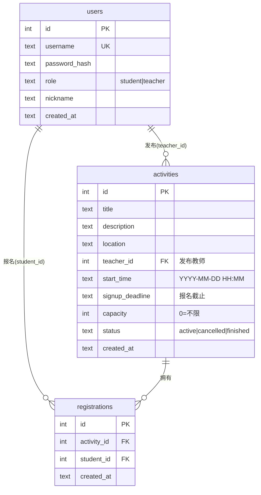
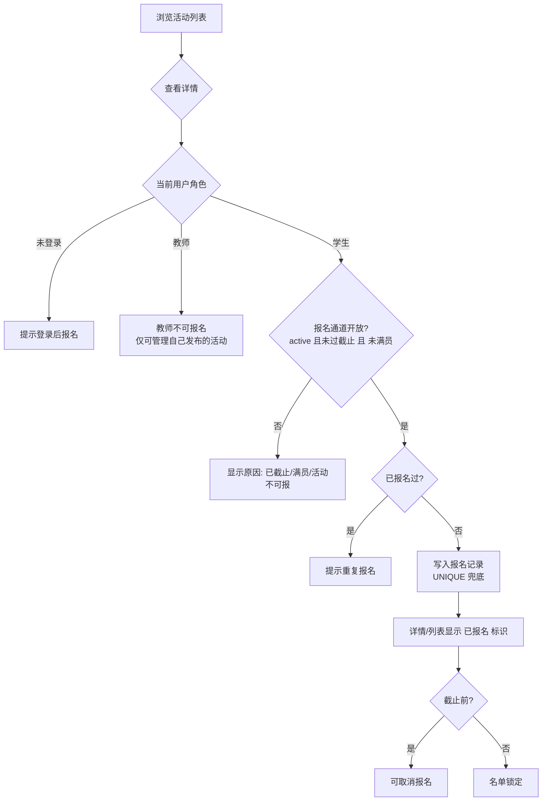
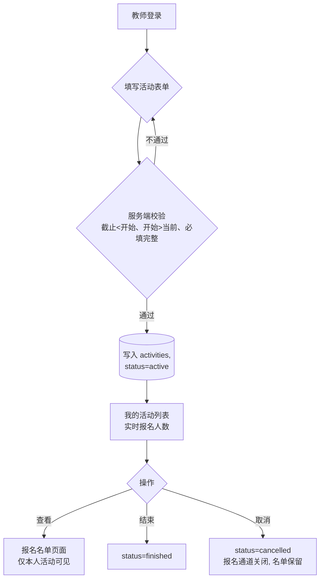

# 03 软件设计

> 校园活动管理系统 V1.0 · 软件设计（依据 01/02 文档；开发中发现明显调整时回填"调整记录"）
> 本设计先于编码形成，对后续开发形成实际指导，并与最终代码保持基本一致。

## 1. 设计目标与总体思路

在满足 02-工程意图 §4 约束的前提下，把系统组织成"**应用工厂 + 按业务划分的蓝图 + 集中数据访问层 + 页面模板**"的结构：

- **按业务切蓝图**：活动业务（成员2）与账号业务（成员1）互不掺入对方的视图逻辑，替换/对接只发生在约定的边界上；
- **集中数据访问**：三张表与全部 SQL 集中在 `app/models.py`，业务代码不散落 SQL；
- **简单优先**：不用 ORM、不引前端框架，模板服务端渲染——依赖面小、课堂环境可运行、便于组员理解与接手。

### 模块结构

```
run.py ──▶ app/__init__.py（create_app 工厂：初始化数据库 → 注册蓝图）
              ├─ config.py            配置
              ├─ models.py            表 DDL + 数据访问层（User/Activity/Registration 相关函数）
              ├─ auth/                账号蓝图 ⚠ 成员1职责占位（views/decorators）
              ├─ activities/          活动蓝图 ★ 成员2 核心（views）
              ├─ templates/           base.html + activities/*.html
              └─ static/style.css
tests/test_activities.py   验证（unittest）
seed.py                    演示数据
docs/                      01 需求 / 02 工程意图 / 03 本设计 / 04 验证
```

## 2. 关键设计决策

1. **Flask + 标准库 sqlite3，不引 SQLAlchemy**
   运行依赖仅 flask 一项。建表使用显式 DDL（本文件 §3 即为实际执行的建表语句，代码与其逐字一致），设计文档 ↔ 数据库表结构可互相核对；也避免 ORM 版本/迁移给小组合并代码带来摩擦。
2. **生命周期状态与"派生状态"分离**
   数据库只保存活动的**生命周期事件状态** `active / cancelled / finished`；而"报名中 / 报名已截止 / 进行中"这类**随时间自动变化**的展示状态一律由 `signup_deadline`、`start_time` 与当前时间推导。理由：报名通道由截止时间自动关闭，不依赖教师手动操作；若把派生状态也落库，会引入大量定时更新/忘记更新带来的状态错位，是多余的出错面。教师只需在两个"事件"上做决定：**结束**、**取消**。
3. **展示状态推导规则**（`activity.display_status(now)`）

   | 库中 status | 时间条件 | 展示 | 报名通道 |
   |---|---|---|---|
   | cancelled | — | 已取消 | 关 |
   | finished | — | 已结束 | 关 |
   | active | now ≤ 截止 | 报名中 | 开 |
   | active | 截止 < now ≤ 开始 | 报名已截止 | 关 |
   | active | 开始 < now | 进行中 | 关 |

   报名通道开启 ⇔ `status='active' AND now ≤ signup_deadline AND (capacity=0 OR 已报名数<capacity)`。
4. **统一时间格式**：全部存储与比较使用 `YYYY-MM-DD HH:MM` 字符串（本机时间），字典序即时间序，直接与 `datetime.now().strftime` 比较，无时区换算。
5. **权限用装饰器集中强制**：`login_required / student_required / teacher_required`（auth/decorators.py），页面与接口共用；资源归属在视图内校验（非本人活动 403）。

## 3. 数据表设计（活动数据表 —— 成员2 设计职责）

### 关系总览



### 建表 DDL（与实际代码逐字一致）

```sql
CREATE TABLE IF NOT EXISTS users (
    id            INTEGER PRIMARY KEY AUTOINCREMENT,
    username      TEXT NOT NULL UNIQUE,
    password_hash TEXT NOT NULL,
    role          TEXT NOT NULL CHECK (role IN ('student','teacher')),
    nickname      TEXT,
    created_at    TEXT NOT NULL DEFAULT (datetime('now','localtime'))
);
-- ⚠ users 表为成员1模块的对接约定（见 §7）

CREATE TABLE IF NOT EXISTS activities (
    id              INTEGER PRIMARY KEY AUTOINCREMENT,
    title           TEXT NOT NULL,
    description     TEXT NOT NULL,
    location        TEXT NOT NULL,
    teacher_id      INTEGER NOT NULL REFERENCES users(id),
    start_time      TEXT NOT NULL,          -- 'YYYY-MM-DD HH:MM'
    signup_deadline TEXT NOT NULL,          -- 报名截止，早于 start_time（应用层校验）
    capacity        INTEGER NOT NULL DEFAULT 0 CHECK (capacity >= 0),  -- 0=不限
    status          TEXT NOT NULL DEFAULT 'active'
                    CHECK (status IN ('active','cancelled','finished')),
    created_at      TEXT NOT NULL DEFAULT (datetime('now','localtime'))
);

CREATE TABLE IF NOT EXISTS registrations (
    id          INTEGER PRIMARY KEY AUTOINCREMENT,
    activity_id INTEGER NOT NULL REFERENCES activities(id),
    student_id  INTEGER NOT NULL REFERENCES users(id),
    created_at  TEXT NOT NULL DEFAULT (datetime('now','localtime')),
    UNIQUE (activity_id, student_id)   -- 防重复报名：数据库层兜底
);
CREATE INDEX IF NOT EXISTS idx_activities_start ON activities(start_time);
CREATE INDEX IF NOT EXISTS idx_reg_activity ON registrations(activity_id);
CREATE INDEX IF NOT EXISTS idx_reg_student  ON registrations(student_id);
```

### 字段设计说明（取舍理由）

- **activities.capacity 默认 0 表示"不限"**：多数校园活动（讲座、展览）没有硬名额，避免教师必须填数字；有容量限制时由 `已报名数 < capacity` 判定满员（应用层 count + 事务内 INSERT，UNIQUE 兜底并发下的重复报名）。
- **registrations 不做冗余列（如姓名快照）**：名单实时 JOIN users 取昵称/账号；V1.0 无"改名后名单追溯"诉求，避免冗余一致性负担。
- **status 用 TEXT + CHECK 而非独立状态表**：候选状态有限且稳定，CHECK 约束保证非法状态写不进库。
- **逻辑删除策略**：教师"取消活动"= status 置 `cancelled`，**记录保留**（含报名名单），不做物理删除——历史可查，实验要求"Git 不得提交私有数据"同理适用于业务数据可追溯性。
- **用户表不存明文密码**；username UNIQUE 提供注册唯一性。

## 4. 业务流程图

### 学生视角（报名主流程）



### 教师视角（发布与管理）



## 5. 页面与路由设计

| 路由 | 方法 | 说明 | 权限 | 对应需求 |
|---|---|---|---|---|
| `/` | GET | 直接重定向到活动列表（引导集中在列表页，见 §8 调整 2） | 公开 | — |
| `/register` `/login` `/logout` | GET/POST | 注册（选身份）/登录/登出 ⚠ 成员1占位 | 公开/已登录 | FR-1 |
| `/activities` | GET | 活动列表（派生状态徽标、名额、按开始时间排序） | 公开 | FR-2 |
| `/activities/<id>` | GET | 详情 + 按身份出操作区 | 公开 | FR-3 |
| `/activities/new` | GET/POST | 发布表单（含时间校验回显） | 教师 | FR-4 |
| `/activities/mine` | GET | 我发布的活动（人数、管理入口） | 教师 | FR-11 |
| `/activities/<id>/signup` | POST | 报名（全规则服务端校验） | 学生 | FR-5 |
| `/activities/<id>/unsignup` | POST | 取消报名（截止前） | 学生（本人） | FR-6 |
| `/activities/<id>/registrants` | GET | 报名名单 | 发布教师本人 | FR-8 |
| `/activities/<id>/finish` | POST | 标记结束 | 发布教师本人 | FR-9 |
| `/activities/<id>/cancel` | POST | 取消活动 | 发布教师本人 | FR-10 |

失败处理：操作类路由一律 **POST + flash 提示 + 重定向**（详情/列表），杜绝直接改库、杜绝仅靠页面隐藏做权限。

## 6. 软件验证设计（对应 04-验证）

- **自动化**：`tests/test_activities.py`（unittest，标准库零依赖），Flask `test_client` + 独立临时数据库，覆盖 02-工程意图 §5 判据 2 的全部规则分支；
- **种子与手工走查**：`seed.py` 生成演示账号与覆盖五种展示状态的活动；走查清单见 04-验证 §2。

## 7. 对接点（成员1 用户模块并入方案）⚠

本版为让 V1.0 闭环可运行，按以下**约定**实现了成员1模块的标准占位。成员1 代码（GitHub 私有仓库）到位后仅需三处最小改动：

1. `app/models.py`：`User` 相关表 DDL/函数对齐队友实际结构（若字段一致则无需改动）；
2. `app/auth/views.py`：替换为成员1 的注册/登录实现，**保持两个约定**：登录成功后 `session['user_id']`、`session['role']` 键名一致；
3. `app/auth/decorators.py`：`current_user()` 读取约定不变则无需改动。

约定摘要：`users(id, username, password_hash, role IN ('student','teacher'), nickname, created_at)`；登录后 session 记 `user_id` 与 `role`。若队友结构不同，改动面被限制在 models + auth 两个目录内，`activities` 蓝图与模板零改动。

## 8. 调整记录（编码中回填，保证"设计-实现基本一致"可解释）

1. **users 表插入须返回新用户 id**：设计未写明返回约定，实现中发现注册后需以 id 建活动/报名关系，`models.create_user` 补为返回 `lastrowid`（见提交 5）。属实现细节补全，不影响表结构设计。
2. **首页实现方式**：路由表原列"`/` 首页（引导到列表/登录）"，实现直接 `redirect` 到活动列表——活动列表本身公开且承担全部引导（未登录显示登录/注册入口），独立首页页价值低，与 02 工程意图"不扩范围"一致，故简化为重定向。路由表对应行已同步。
3. **取消报名窗口**：需求 FR-6 规定截止前可取消。实现对"已结束/已取消"活动即使未过截止也不可取消（名单锁定），使三种收口（截止/结束/取消）下名单语义一致——比单纯时间判断更贴合"名单稳定"目标（01 §6 第 2 条），在此登记以便追溯。
